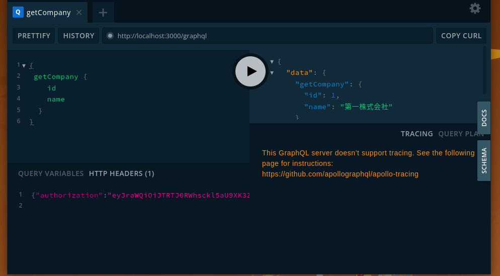

# invoice

## Git pre-commit hook set up

```bash
git config --local core.hooksPath .githooks
```

そして、ルートディレクトリに `.env` ファイルを設置(必要な人のみにGoogle docsで配布)

## Set up

```bash
docker-compose build
```

backend の開発のためにローカルで

```bash
cd back
npm i -g @nestjs/cli
npm i
```

をおすすめします．VSCode では，`back/`で作業することにより，うまく補完が読み込まれるようになります．

## Start

```bash
docker-compose up
```

このあと http://localhost に接続すると、front に接続できます。

## Test of backend

```bash
docker-compose exec back npm run test
```

## Show logs

```bash
docker-compose logs -f [コンテナ名(back, front, db)]
```

## 認証

Cognito を用いて認証を行う。

~~説明動画が [Slack](https://akaricore.slack.com/archives/C0324EMF610/p1648888825748559) にある。~~

上記動画は部分的に正しくないので、現時点では参考にしないようにお願いします。

### 開発時のfrontへのログイン

[サインインページ（http://localhost/signin）](http://localhost/signin)にアクセスし、事前に登録されている（今まで使っていた）メールアドレスとパスワードを入力する。

### 開発時のGraphQLでの認証

```
docker-compose exec back npm run login
```

で取得できる JSON(Authentication Header) を下の画面 (http://localhost:3000/graphql) の左下の HTTP HEADERS に貼り付ける。

  

### 開発ユーザーの登録（WIP）

**未完成の機能です！！**

```
docker-compose exec back npm run register-user hogehoge
```

でcognito上に登録される。

### 本番環境での認証の準備(DBに入ってない場合。ここは seed.yml への記入にしたい)

0. Cognito の認証を一度削除する
1. admin (http://localhost:3080/) に akariinc.co.jp の google アカウントでログインし、UnconfirmedUserを登録する
2. front のユーザー登録からメールアドレス(**氏名とふりがなを必ずつけること**) を入力し、ユーザー登録
3. メールアドレスの検証コードの入力
